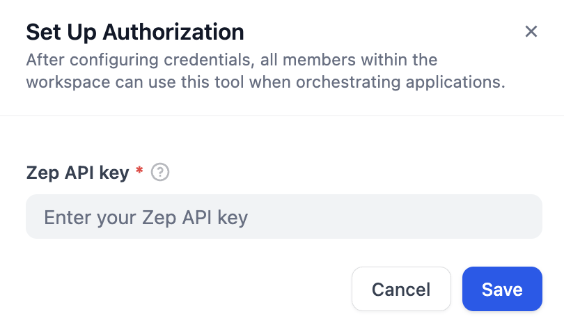
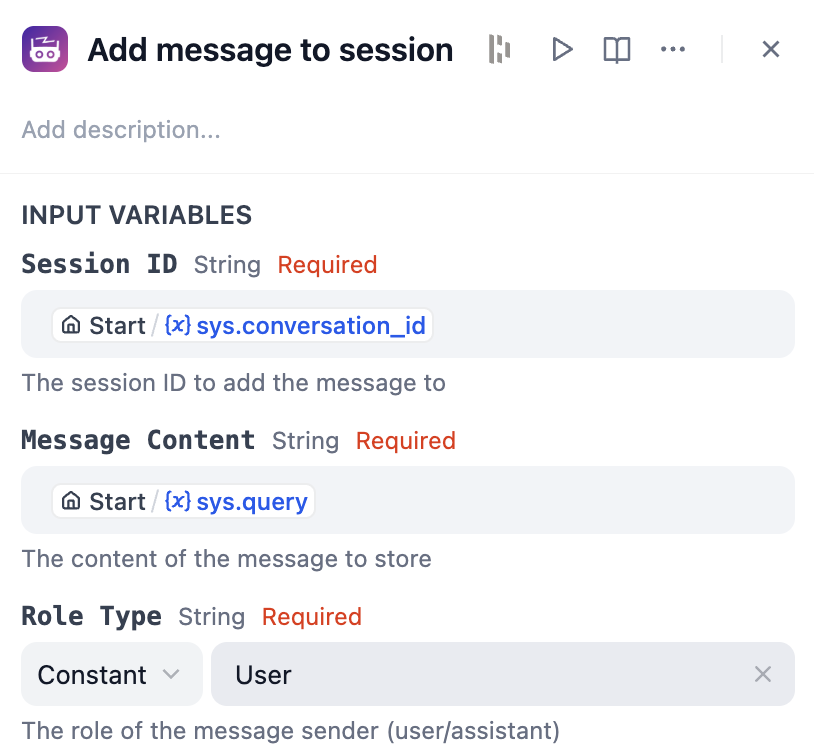

# Dify Zep Plugin

A plugin for Dify that adds memory management using Zep. This helps your AI assistant remember past conversations and user information.

[View on GitHub](https://github.com/obadakhalili/dify-zep-plugin)

## Setup

1. Install the plugin in your Dify workspace
2. Create a Zep project and get an API key
3. Add your Zep API key to authorize the plugin
4. (Optional) Use the `zep_api_url` field to define a custom base URL for the API if you are using a different Zep instance.

   
   

## Tools

### 1. Init Session

Creates a Zep user and session if they don't already exist. Must be used first before other tools.

**Parameters:**

- User ID - Unique identifier for the user
- Session ID - Unique identifier for the conversation

Returns the created or existing session details.

  

### 2. Add Message to Session

Saves a message to the conversation memory.

**Parameters:**

- Session ID - The conversation to add to
- Message - The text content to save
- Role Type - Who sent the message (user or assistant)
- Return Context (optional) - If true, also return relevant memory context
- Ignore Roles (optional) - Roles to ignore when adding the message to graph memory

  

### 3. Get Session Memory

Gets user memory relevant to the last messages in the conversation.

**Parameters:**

- Session ID - The conversation to get relevant memory for
- Last N Messages (optional) - Number of recent messages to check (max 50)
- Minimum Rating (optional) - Only return memories above this relevance score

  

### 4. Search User Graph

Search through a user's memory for relevant information.

**Parameters:**

- User ID - The user to search memories for
- Query - What to search for in the memory

  

**Difference between `Get Session Memory` and `Search User Graph` tools:**

- `Get Session Memory` uses the last n messages in the conversation to compose a query and search the user's memory for relevant information.
- `Search User Graph` searches the user's memory for a query you provide.

### 5. Delete Session

Removes a session and all of its stored memory.

**Parameters:**

- Session ID - The session to remove

### 6. Get Session

Retrieves details about a session.

**Parameters:**

- Session ID - The session to fetch

## Example workflow

## To-Dos:

- [ ] What if the user want to use the plugin with different API keys from more than one project?
- [ ] How to use outside workflow apps?
- [ ] Use `return_context` in `memory.get()` to use context immediatley.
